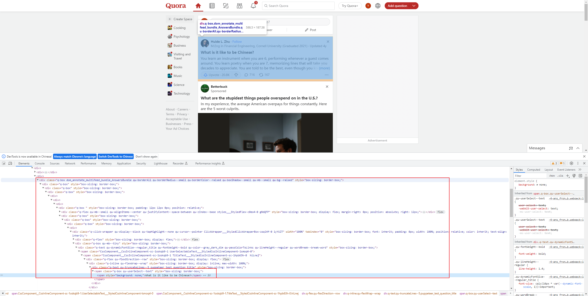

- Yang Li
- Institute of Computing Technology, Chinese Academy of Sciences

- 本仓库只作学习用途，请勿用于任何商业行为和违法行为，否则后果自负。

# 获取数据

## 知乎数据

可以直接使用`requests`库对网页进行get操作，将返回的html使用`lxml`库进行解析，得到问题及问题链接：


对问题的所有答案进行爬取时，使用知乎的api获得网页内容的json格式数据：


可以看到最后使用`is_end`和`next`指明了该页面是否需要翻页已经翻页后的页面地址，因此我们只需要针对一个问题访问多个url就可以得到全部的回答：

```python
global question_id
question_id = url.split('/')[-1]  # url为问题链接

# 使用知乎的api进行爬取
answer_dict = {}
url_api = f'https://www.zhihu.com/api/v4/questions/{question_id}/feeds?include=data%5B%2A%5D.is_normal%2Cadmin_closed_comment%2Creward_info%2Cis_collapsed%2Cannotation_action%2Cannotation_detail%2Ccollapse_reason%2Cis_sticky%2Ccollapsed_by%2Csuggest_edit%2Ccomment_count%2Ccan_comment%2Ccontent%2Ceditable_content%2Cattachment%2Cvoteup_count%2Creshipment_settings%2Ccomment_permission%2Ccreated_time%2Cupdated_time%2Creview_info%2Crelevant_info%2Cquestion%2Cexcerpt%2Cis_labeled%2Cpaid_info%2Cpaid_info_content%2Creaction_instruction%2Crelationship.is_authorized%2Cis_author%2Cvoting%2Cis_thanked%2Cis_nothelp%3Bdata%5B%2A%5D.mark_infos%5B%2A%5D.url%3Bdata%5B%2A%5D.author.follower_count%2Cvip_info%2Cbadge%5B%2A%5D.topics%3Bdata%5B%2A%5D.settings.table_of_content.enabled&offset=0&limit=5&order=default&platform=desktop'
is_end = False  # 不一定够20个回答，需要用该参数进行判断，防止死循环（也是知乎的api）
# print(url_api)

num_answer = len(answer_dict)
while not is_end and num_answer < top_k:
    is_end, next_url_api = spider_for_zhihu(url_api, answer_dict, num_answer, usr_info)
    # print(type(is_end))
    num_answer = len(answer_dict)
    url_api = next_url_api

    answer_list.append(answer_dict)
```

对获得的数据进行简单的组织，并保存在json里即可。

同时，由于知乎热榜是变化的，每天爬取热榜内容大概在2M左右，因此扩展数据容量比较方便，只需要每天都爬就可以了。

## Quora数据

Quora是动态加载页面，因此我们只能通过`selenium`库对浏览器行为进行模拟。



单击`more`之后会得到问题的链接：


和知乎一样，Quora的首页也是实时变化的，因此扩展数据容量也比较方便。

# 数据处理

## 中文数据


## 英文数据


# 验证Zipf's law（齐夫定律）


# 参考文档

1. [python爬虫实战（2）——爬取知乎热榜内容 - 知乎 (zhihu.com)](https://zhuanlan.zhihu.com/p/356993821)
2. [爬虫实战7：知乎热榜爬取 - 知乎 (zhihu.com)](https://zhuanlan.zhihu.com/p/163854249)
3. [python爬虫系列--lxml（etree/parse/xpath)的使用_etree.parse-CSDN博客](https://blog.csdn.net/qq_35208583/article/details/89041912)
4. [Python 获取并输出当前日期、时间_python输出当前日期月日-CSDN博客](https://blog.csdn.net/beautiful77moon/article/details/88877519)
5. [【python】保存数据到JSON文件-CSDN博客](https://blog.csdn.net/lm3758/article/details/82966591)
6. [【2023知乎爬虫】知友怎么看待《罗刹海市》？爬了上千条知乎回答！ - 知乎 (zhihu.com)](https://zhuanlan.zhihu.com/p/647671891)
7. [Python爬虫实战：抓取知乎问题下所有回答-腾讯云开发者社区-腾讯云 (tencent.com)](https://cloud.tencent.com/developer/article/1881294)
8. [爬取quora中China相关的话题 - 知乎 (zhihu.com)](https://zhuanlan.zhihu.com/p/292575811)
9. [selenium.common.exceptions.WebDriverException: Message: Service chromedriver unexpectedly exited.-CSDN博客](https://blog.csdn.net/qq_51459600/article/details/118497137)
10. [使用Python的Selenium进行网络自动化的入门教程 - 掘金 (juejin.cn)](https://juejin.cn/post/7171300716194054180)
11. [Python爬虫（1）一次性搞定Selenium(新版)8种find_element元素定位方式_find_element python-CSDN博客](https://blog.csdn.net/qq_16519957/article/details/128740502)
12. [如何使用Xpath定位元素（史上最清晰的讲解）_xpath选择某个内容的元素-CSDN博客](https://blog.csdn.net/qq_43022048/article/details/89455496?ops_request_misc=%7B%22request%5Fid%22%3A%22167487981916800213085071%22%2C%22scm%22%3A%2220140713.130102334.pc%5Fall.%22%7D&request_id=167487981916800213085071&biz_id=0&utm_medium=distribute.pc_search_result.none-task-blog-2~all~first_rank_ecpm_v1~hot_rank-5-89455496-null-null.142^v71^control_1,201^v4^add_ask&utm_term=XPATH定位&spm=1018.2226.3001.4187)