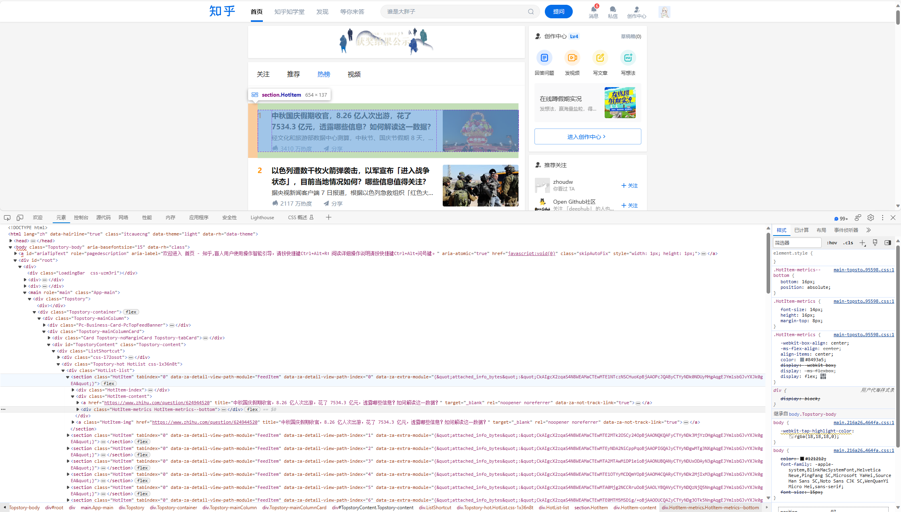

# 参考文档

1. [python爬虫实战（2）——爬取知乎热榜内容 - 知乎 (zhihu.com)](https://zhuanlan.zhihu.com/p/356993821)
2. [爬虫实战7：知乎热榜爬取 - 知乎 (zhihu.com)](https://zhuanlan.zhihu.com/p/163854249)
3. [python爬虫系列--lxml（etree/parse/xpath)的使用_etree.parse-CSDN博客](https://blog.csdn.net/qq_35208583/article/details/89041912)
4. [Python 获取并输出当前日期、时间_python输出当前日期月日-CSDN博客](https://blog.csdn.net/beautiful77moon/article/details/88877519)
5. [【python】保存数据到JSON文件-CSDN博客](https://blog.csdn.net/lm3758/article/details/82966591)
6. [【2023知乎爬虫】知友怎么看待《罗刹海市》？爬了上千条知乎回答！ - 知乎 (zhihu.com)](https://zhuanlan.zhihu.com/p/647671891)
7. [Python爬虫实战：抓取知乎问题下所有回答-腾讯云开发者社区-腾讯云 (tencent.com)](https://cloud.tencent.com/developer/article/1881294)
8. 